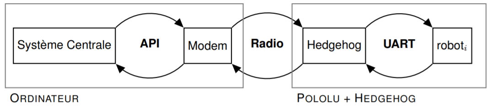

# IMTA-PS5-EssaimRobots
IMT Atlantique 3rd year project - Localization system for a swarm of mobile robots

## Repository arborescence

```
│
└─── src
│	│
│	└─── Arduino 
│	│	│
│	│   	└── Hedgehog_Zumo32U4_TXonly
│	│   	└── Hedgehog_MEGA_TXonly
│	│   	└── EssaimRobots
│	│
│	└─── ModemAPI
│		│
│	    	└── original
│	    	└── ours
│
└─── assets
│	│
│	└─── img
│	└─── diagrams
```

- `src` : Folder containing code
	- `Arduino` : Folder containing Arduino // C++ code 
		- `Hedgehog_MEGA_TXonly` : Unit Test - UART reception on Arduino MEGA 2560 from Marvelmind Hedgehog
		- `Hedgehog_Zumo32U4_TXonly` : Unit Test - UART reception on Pololu Zumo 32U4 from Marvelmind Hedgehog
		- `EssaimRobots` : Main program
	- `ModemAPI` : Folder containing the API implementation 
		- `original` : original code (from Marvelmind's web site)
		- `ours` : our implementation
- `assets` : Folder containing images and diagrams used in readmes. 

## Communication chain 

In order to send instructions to the robots evolving in a swarm, we use the communication chain depicted in the following figure. 



- Communication between the Hedgehog and the Pololu robot is assured by the UART protocol. Only reception of and response to requests from the point of view of the Pololu robot was implemented, following [this guide](/ressources/marvelmind_interfaces_10_02_2022.pdf).
- Communication between the Modem and the Hedgehog is assured by Marvelmind's propietary communication protocol, via radio.
- Communication between the Central System (Core) and the Modem was implemented by us (`ModemAPI` folder), following [this guide](ressources/marvelmind_interfaces_10_02_2022.pdf).
